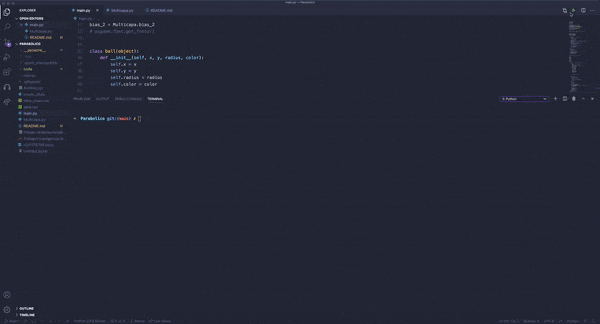

# Trabajo 2 de Inteligencia Artificial
## Objetivo
Crear un sitema de redes neuronales que permita la predicción si dado el poder y el angulo, el misil dará en el objetivo. 

## Recpilicaión de Dataset
Se simulo 10000 disparos con angulos y poder aleatorios y se guardaron sus resultados, ademaás de un output:
- 1: Si le dio al objetivo
- 0: Si no le dio al objetivo 

## Integrantes
- Renzo Damian Gomez
- Luis Guadalupe Carrillo
## Requerimientos
Python 3.7 o mayor
Pygame
numpy

## Instalación
```bash
pip install pygame
pip install numpy
git clone https://github.com/renzodamgo/Parabolico.git
```

## Ejecutar simulación
```bash
python3 main.py
```

## Resultados
Se entrena a la red neuronal con el dataset obtenido de la simulación:


La red predice si le dará al objetivo con un 70% de probabilidad de acierto:


